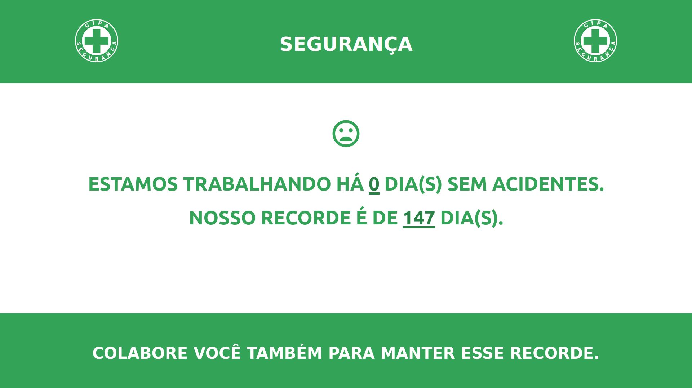
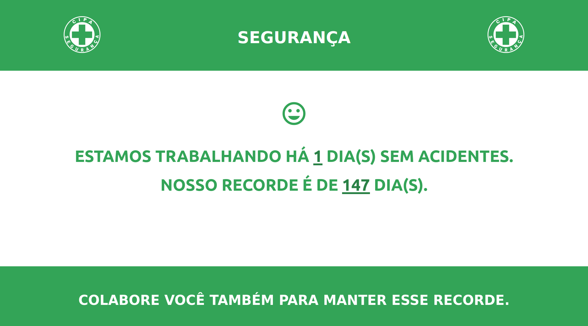

# PLACA CIPA PARA CONTAGEM DE DIAS SEM ACIDENTES
*Contador automátco de dias sem acidentes usado pela  **CIPA***

A data do último acidente o récorde de dias sem acidentes podem ser alteradas no arquivo `script.js`.

  

*Obs, **css** não é meu forte.*